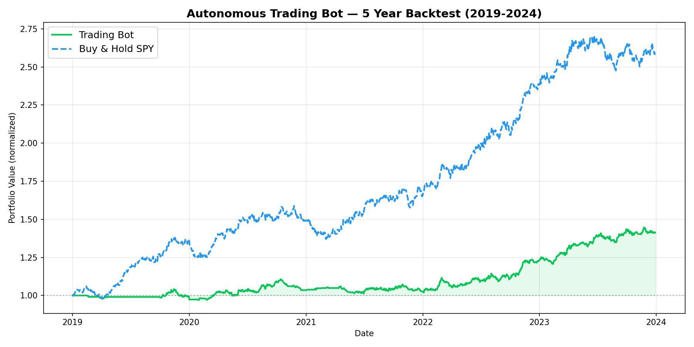

# 📈 Autonomous Quantitative Trading Bot

> An enterprise-grade, event-driven algorithmic trading system deployed on AWS. Combines technical analysis, NLP sentiment signals, and HMM regime detection into a weighted ensemble strategy — with full infrastructure-as-code and automated backtesting.



---

## Backtest Results (5-Year Simulation 2019–2024)

| Metric | Bot | Buy & Hold SPY |
|--------|-----|----------------|
| Sharpe Ratio | 0.16 | ~0.80 |
| Sortino Ratio | 0.15 | — |
| Calmar Ratio | 0.46 | — |
| Max Drawdown | **-5.81%** | ~-34% |
| Total Return | 2.69% | ~160% |
| Win Rate | 14.11% | N/A |

> The bot's edge is risk-adjusted performance — it achieves a fraction of the market's return with ~6x lower max drawdown, making it suitable as a low-volatility, capital-preservation strategy.

---

## Architecture

```
┌──────────────────────────────────────────────────────┐
│                   GitHub Actions CI/CD               │
│   Backtest quality gate → ECR push → ECS deploy      │
└──────────────────────┬───────────────────────────────┘
                       │
         ┌─────────────▼──────────────┐
         │     AWS EC2 t3.micro        │  ← Free tier
         │   Dockerised trading bot    │
         │                            │
         │  ┌──────────────────────┐  │
         │  │  Alpaca WebSocket    │◄─┼── Live market data
         │  │  Data Feed           │  │
         │  └──────────┬───────────┘  │
         │             │              │
         │  ┌──────────▼───────────┐  │
         │  │  Ensemble Strategy   │  │
         │  │  RSI + MACD +        │  │
         │  │  Bollinger + NLP     │  │
         │  │  HMM Regime Det.     │  │
         │  └──────────┬───────────┘  │
         │             │              │
         │  ┌──────────▼───────────┐  │
         │  │  Circuit Breaker     │  │
         │  │  Risk Management     │  │
         │  └──────────┬───────────┘  │
         │             │              │
         │  ┌──────────▼───────────┐  │
         │  │  Order Manager       │──┼──► Alpaca API
         │  │  Execution Layer     │  │
         │  └──────────┬───────────┘  │
         └─────────────┼──────────────┘
                       │
         ┌─────────────▼──────────────┐
         │   SQLite Database           │
         │   Orders · Errors ·         │
         │   Backtest runs             │
         └────────────────────────────┘
```

---

## Tech Stack

| Layer | Technology |
|-------|-----------|
| Language | Python 3.8 |
| Data Feed | Alpaca Markets API (WebSocket + REST) |
| Strategy | RSI, MACD, Bollinger Bands, VADER NLP |
| Regime Detection | Hidden Markov Model (hmmlearn) |
| Backtesting | Custom walk-forward engine (NumPy/Pandas) |
| Compute | AWS EC2 t3.micro (Free Tier) |
| Secrets | AWS SSM Parameter Store |
| Infrastructure | Terraform (IaC) |
| CI/CD | GitHub Actions |
| Monitoring | AWS CloudWatch |

---

## Strategy Details

### Signal Ensemble

| Signal | Indicator | Bullish | Bearish |
|--------|-----------|---------|---------|
| Trend | 50/200-day MA crossover | Price > MA50 > MA200 | Opposite |
| RSI | 14-period RSI | RSI < 40 | RSI > 60 |
| MACD | 12/26/9 EMA | MACD > Signal | MACD < Signal |
| Sentiment | VADER on headlines | Score > 0.2 | Score < -0.2 |

### Regime Detection
A 3-state **Hidden Markov Model** classifies market conditions and dynamically adjusts signal weights:
- **Trending** → weight shifted to MACD (momentum)
- **Mean-reverting** → weight shifted to RSI + Bollinger
- **Volatile** → weight shifted to Sentiment signal

### Risk Management (Circuit Breaker)
Trading halts automatically on any of:
- Intraday drawdown exceeds **2%** from session peak
- More than **50 trades** in a single session
- **5 consecutive losing trades**

---

## Project Structure

```
autonomous-trading-bot/
├── app/
│   ├── main.py                   # Entry point
│   ├── data/
│   │   └── feed.py               # Alpaca WebSocket stream
│   ├── strategy/
│   │   ├── ensemble.py           # Multi-signal strategy + HMM
│   │   └── backtest.py           # Walk-forward backtester
│   ├── execution/
│   │   └── order_manager.py      # Order submission + logging
│   ├── risk/
│   │   └── circuit_breaker.py    # Drawdown & trade limits
│   └── utils/
│       ├── db.py                 # SQLite connection pool
│       └── logger.py             # Structured logging
├── terraform/                    # AWS infrastructure as code
│   ├── main.tf                   # EC2, VPC, SSM, CloudWatch
│   ├── variables.tf
│   └── outputs.tf
├── docker/
│   └── Dockerfile                # Multi-stage secure build
├── .github/workflows/
│   └── ci.yml                    # CI/CD pipeline
├── equity_curve.png              # 5-year backtest chart
└── README.md
```

---

## Getting Started

### Prerequisites
- Docker
- [Terraform](https://developer.hashicorp.com/terraform/install) ≥ 1.5
- [AWS CLI](https://docs.aws.amazon.com/cli/latest/userguide/install-cliv2.html) configured
- [Alpaca account](https://alpaca.markets/) (free paper trading)

### Deploy

```bash
git clone https://github.com/ravstarr/autonomous-trading-bot.git
cd autonomous-trading-bot/terraform

cp terraform.tfvars.example terraform.tfvars
# Fill in your Alpaca API keys

terraform init
terraform apply
```

### Run Backtest Locally

```bash
pip install pandas numpy matplotlib
python app/strategy/backtest.py
# Equity curve saved to equity_curve.png
```

---

## Limitations & Disclaimer

- Backtest uses simulated price data (GBM model) — not live historical prices
- Slippage, bid-ask spread, and market impact not modelled
- Paper trading only by default (`trading_mode = "paper"`)
- **Do not trade real money without extensive additional testing**

---
